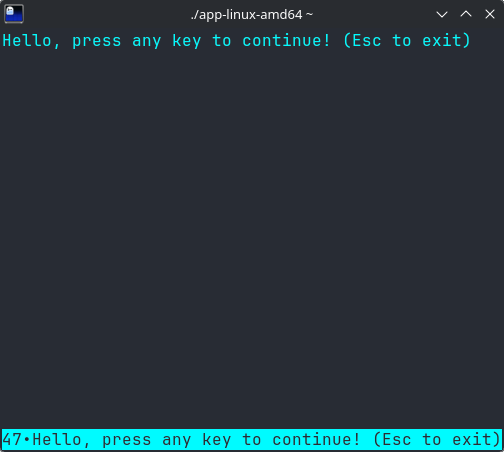

# Kotter + GraalVM Native Image + GitHub Actions

A colorful demo for the terminal built with Kotlin and [Kotter](https://github.com/varabyte/kotter)

## Features

- **Gradle** example project shows reactive terminal rendering with **Kotter**
- **GraalVM Native Image** can be utilized to build native executables
- **GitHub Actions** workflow configured for Linux/macOS/Windows builds

## Usage

To run the application during development inside a virtual terminal:

`./gradlew test` (`run` will **not** work with good reason[^1])

To generate a standalone executable for your current platform:

`./gradlew nativeCompile`

The binary will be located in: `app/build/native/nativeCompile/`

## Structure

- `gradle/libs.versions.toml`: Plugin/library dependencies and version management
- `app/build.gradle.kts`: Build script utilizing Gradle plugin for GraalVM Native Image
- `app/src/main/kotlin/org/example/App.kt`: Main rendering loop and input handling
- `.github/workflows/release.yml`: Automated native build and release pipeline

[^1]: Gradle and Kotter cannot share the output streams, so Kotter tries to run inside `VirtualTerminal` instead,
which we want to avoid for the native build because of its heavy GUI dependencies.
